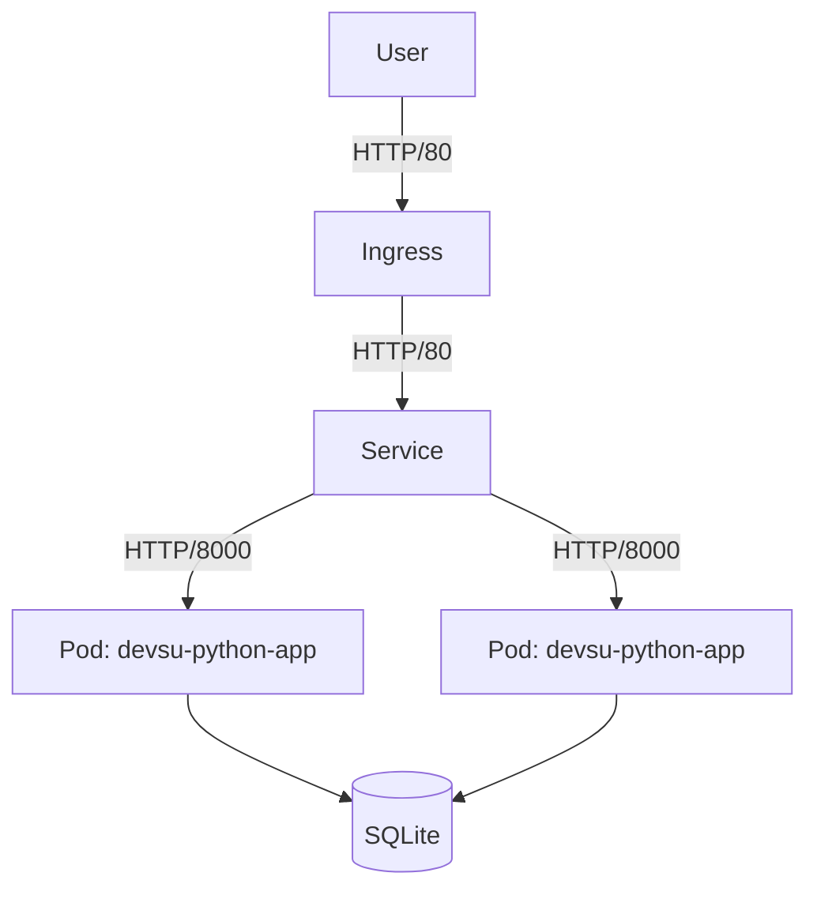

# Demo Devops Python

This is a simple application to be used in the technical test of DevOps.


## Architecture



## Getting Started

### Prerequisites

- Python 3.11.3
- Docker
- Kubernetes (Minikube / Docker Desktop)

### Local Development

1. Clone this repo.

   ```bash
   git clone https://bitbucket.org/devsu/demo-devops-python.git
   ```

2. Install dependencies.

   ```bash
   pip install -r requirements.txt
   ```

3. Migrate database

   ```bash
   py manage.py makemigrations
   py manage.py migrate
   ```

4. Run server
   ```bash
   py manage.py runserver
   ```

### Docker

Build the image:

```bash
docker build -t devsu-python-app .
```

Run the container:

```bash
docker run -p 8000:8000 devsu-python-app
```

### Kubernetes Deployment

Deploy to local cluster:

```bash
kubectl apply -f k8s/
```

Verify deployment:

```bash
kubectl get pods
kubectl get svc
kubectl get ingress
```

Access the application at `http://devsu-python.local` (ensure you add this to your `/etc/hosts` pointing to `127.0.0.1`).

### CI/CD Pipeline

The project includes a GitHub Actions pipeline `.github/workflows/pipeline.yml` that performs:

1. **Test**: Lints code and runs unit tests.
2. **Build & Push**: Builds Docker image and pushes to Docker Hub (requires secrets `DOCKER_USERNAME` and `DOCKER_PASSWORD`).

## Usage

To run tests you can use this command.

```bash
py manage.py test
```

To run locally the project you can use this command.

```bash
py manage.py runserver
```

Open http://localhost:8000/api/ with your browser to see the result.

### Features

These services can perform,

#### Create User

To create a user, the endpoint **/api/users/** must be consumed with the following parameters:

```bash
  Method: POST
```

```json
{
  "dni": "dni",
  "name": "name"
}
```

If the response is successful, the service will return an HTTP Status 200 and a message with the following structure:

```json
{
  "id": 1,
  "dni": "dni",
  "name": "name"
}
```

If the response is unsuccessful, we will receive status 400 and the following message:

```json
{
  "detail": "error"
}
```

#### Get Users

To get all users, the endpoint **/api/users** must be consumed with the following parameters:

```bash
  Method: GET
```

If the response is successful, the service will return an HTTP Status 200 and a message with the following structure:

```json
[
  {
    "id": 1,
    "dni": "dni",
    "name": "name"
  }
]
```

#### Get User

To get an user, the endpoint **/api/users/<id>** must be consumed with the following parameters:

```bash
  Method: GET
```

If the response is successful, the service will return an HTTP Status 200 and a message with the following structure:

```json
{
  "id": 1,
  "dni": "dni",
  "name": "name"
}
```

If the user id does not exist, we will receive status 404 and the following message:

```json
{
  "detail": "Not found."
}
```

## License

Copyright © 2023 Devsu. All rights reserved.
